# :bulb: PROCESO CREATIVO
 
**Para llevar acabo esta investigación se uso un poco de distintas metodologías, UX Research, Lean UX y Design Thinking.**
**El primer paso fue elegir el tema , el que más me llamó la atención fue Pokemon Go, una vez decidido comencé a revisar la data proporcionada y a pensar en el usuario.**

## ¡A JUGAR!

**Descargué la app Pokémon Go y  salí a cazar pokemones… ¡gajes del oficio!. La finalidad era familiarizarme  y conocer la dinámica del juego.**

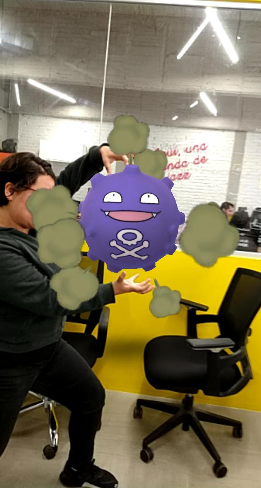

**Para tener un acercamiento a los usuarios me integré a tres comunidades de jugadores de Pokémon GO en Facebook.**

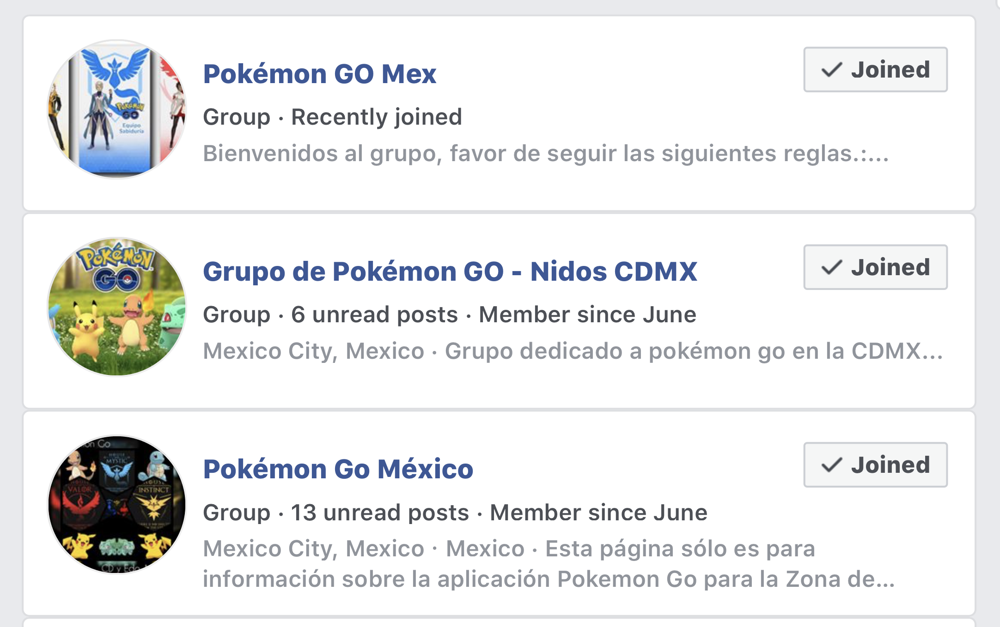

**Además lleve acabo una misión exploratoria a la Alameda Central de la CDMX, ahí realicé dos entrevistas que me dieron un punto de partida, los informantes fueron muy claros con sus necesidades.**

## ¿QUÉ ES LO QUE QUIEREN VER LOS JUGADORES DE POKÉMON GO? 

**En resumen, las necesidades de los usuarios eran saber los Individual Values (IV) que son los  valores individuales de cada pokémon; ataque, defensa y estamina (vida), datos útiles a la hora de combate, y saber sobre los ataques de cada pokémon.**

## ¿PROPUESTA?

**Al conocer las necesidades de los usuarios el planteamiento fue hacer una página web que  permitiera comparar esas características entre dos o tres ejemplares de pokémon.**

## PROBLEMÁTICA

**Ahora que ya tení de dónde partir, contrasté la data proporcionada en el archivo src con lo mostrado en la interfaz del juego.**

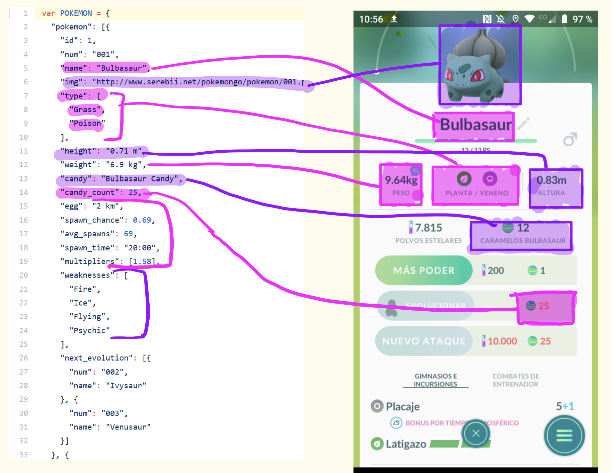

**Al revisar la data que se proporcionó y las necesidades que se detectaron en las entrevistas… !Oh sorpresa! No se ajustaban,fue entonces que hice un poco de investigación en blogs y videos de youtube donde confirmé que las necesidades que se expresaron en las entrevistas eran generalizadas. En este punto investigué qué herramientas proporcionan una resolución a esas sugerencias, se econtraron dos aplicaciones para Android y una para IOS, sin embargo ninguna de ellas compara los valores de los pokemones.**

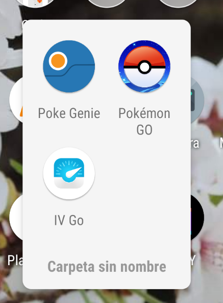

**Estas aplicaciones te proporcionan el IV a partir del Poder de Combate (PC) y los Puntos de Salud (PS) de cada pokémon, ambos datos sí los proporciona la app POKÉMON GO sin embargo no están dentro de la data proporcionada en el src del proyecto Data Lovers.**

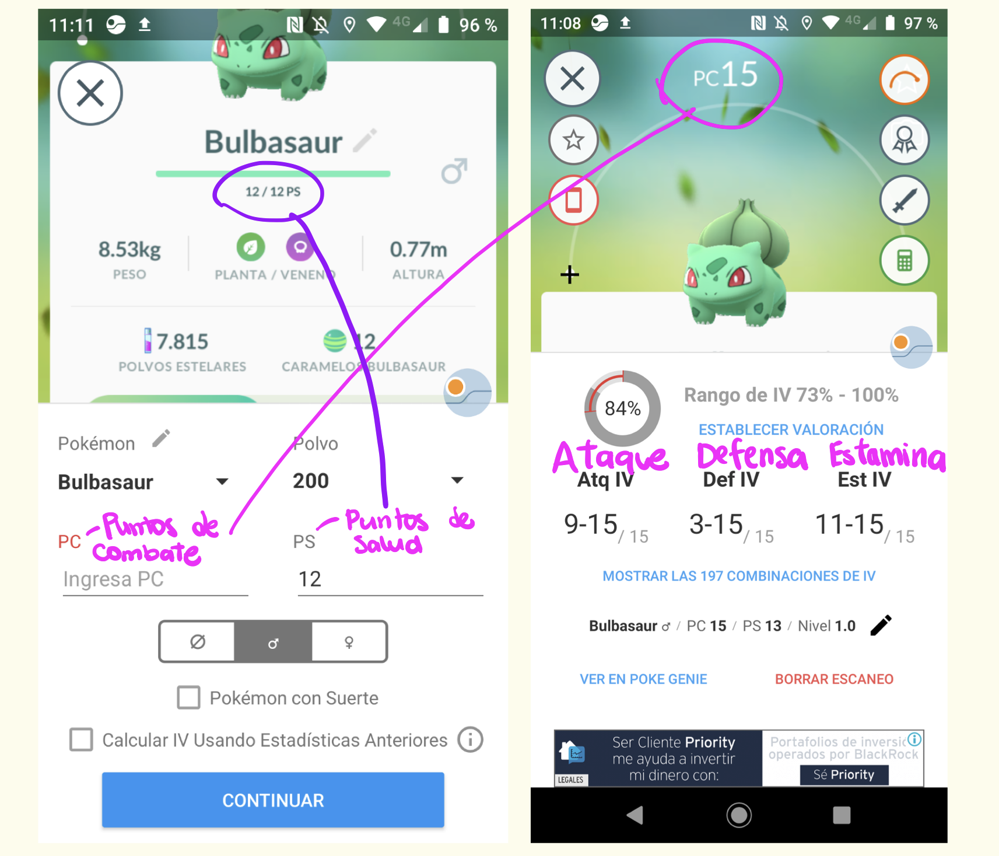

**En este punto habaía dos opciones, meter los datos de los 151 pokemones manualmente o restringirme a la data proporcionada. Por cuestiones de tiempo … y de salud mental opté por la segunda.**

## ¿USUARIO VS CLIENTE?

**En este punto hubo una discordancia entre lo que quiere el cliente, en este caso Laboratoria y el proyecto Data Lovers, y las necesidades  de los usuarios reales. En este caso particular de POKÉMON GO, el primer acercamiento que tuve para empatizar con el usuario y entenderlo arrojó una expectativa que no se cumpliría por que el cliente no contemplaba esa data. En el mundo real la app POKÉMON GO tampoco la proporciona en la interfaz del usuario, inclusive hay descontento en la comunidad por lo mismo. Mucho se habla de lo poco importante que es la información que te provee la app y la necesidad innecesaria de descargar otras apps para obtener información que te ayude a mejorar como jugador. La forma para llevar a cabo el proyecto a pesar de que no coincidían ambas necesidades fue ceñirme a los datos y pasar por alto lo real.**

## RESOLUCIÓN 

**El planteamiento fue ¿Qué de lo que hay disponible en la data del proyecto Data Lovers es importante para este juego? Como ya me había involucrado con el producto sabí que el tipo de pokémon, sus debilidades, sus evoluciones y los caramelos necesarios para evolucionar  son características importantes a la hora de decidir con qué pokémon vamos a combatir.**

**Una vez reestablecido los valores con los que disponía se creó la encuesta, se tomaron seis datos que sí aparecen en la data y se le propuso al encuestado elegir los tres más importantes, además de elegir qué le gustaría comparar, de esas características ya mencionadas, entre sus pokemones. Para definir al usuario se le pidió su edad y su género.**

**Teniendo esto en mente se lanzó la encuesta a las comunidades de FB, permanecería abierta desde el martes 25 de junio a las 6pm hasta el miércoles 26 de junio a la 10am.**

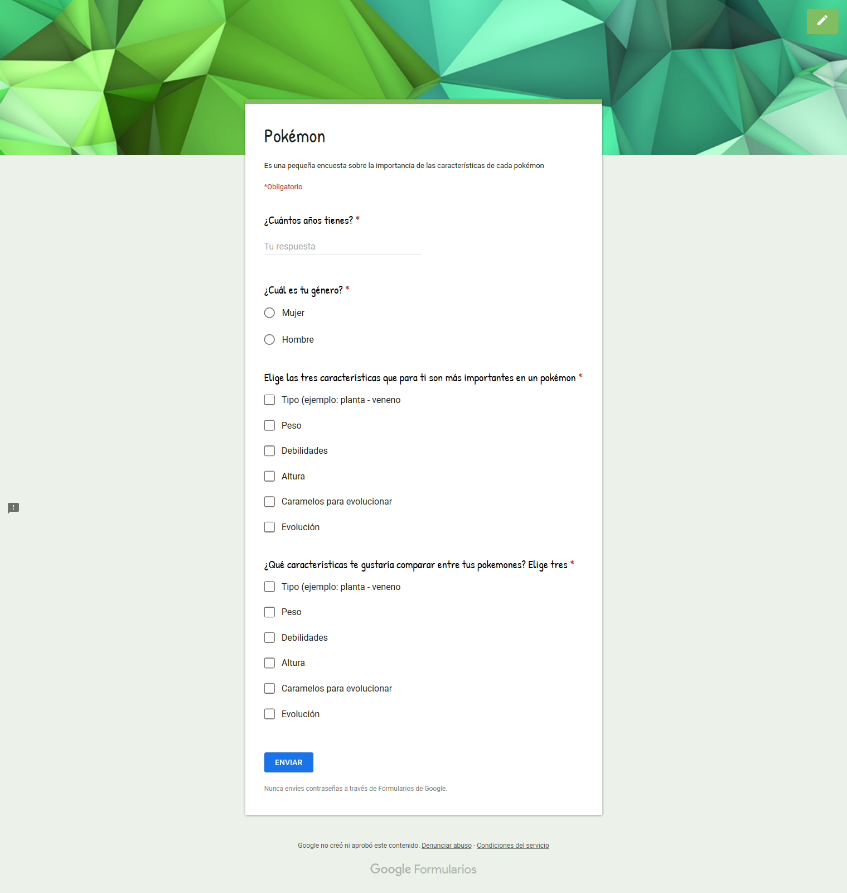

**La respuesta fue muy positiva en las comunidades de FB, incluso una de las administradoras compartió la encuesta por grupos de WhatsApp, además nos agregó en un grupo de puras mujeres jugadoras de POKÉMON GO.**

**Sobre el grupo de WhatsApp me gustaría hacer un comentario que vas más relacionado a esto que significa Laboratoria para las mujeres y la sociedad. Hay dos requisitos para ser aceptada en este grupo de sólo mujeres, cito a la administradora que nos añadió “La primer regla es mucho respeto, y la segunda, y última es enviar un audio presentándonos y así verificamos ser chicas… porque es un juego predominantemente jugado por hombres y luego son muy manchados” ,  es un tema que debe ser puntualizado en nuestros proyectos porque hacerlo notar es un paso para hacer un cambio.**

## FEEDBACK DE LA ENCUESTA 

**Recibí dos comentarios acerca de nuestra encuesta.**
**El primero...**

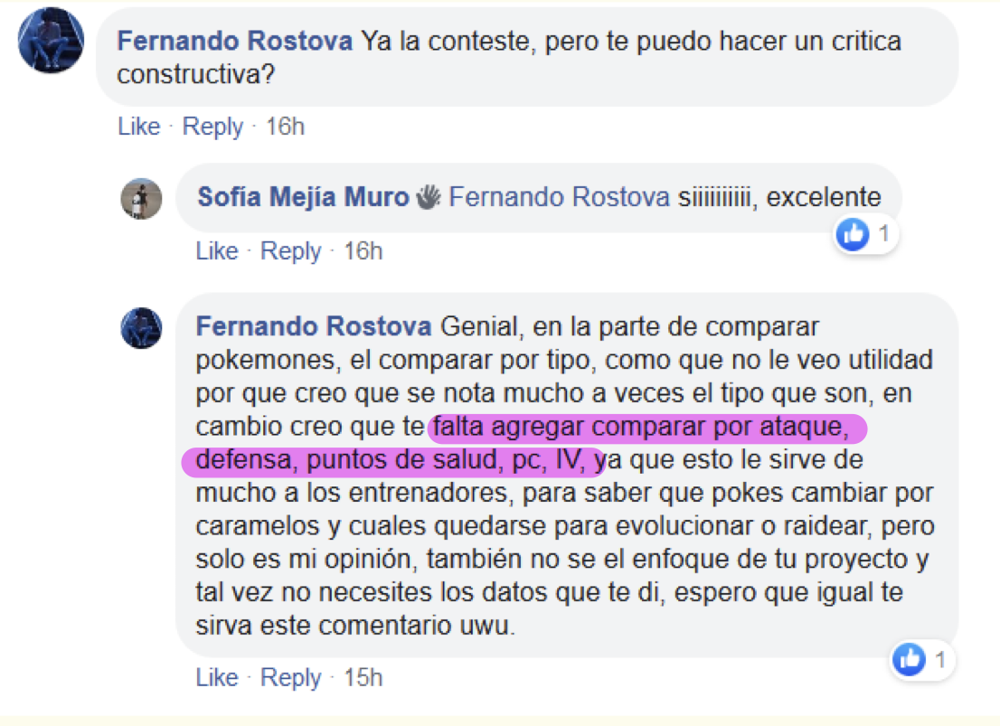

**El segundo...**

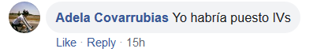

**Como se puede notar, las necesidades de los usuarios son los IV, datos que tampoco proporciona la app POKÉMON GO.**

## RESULTADOS DE LA ENCUESTA

**Participaron en la encuesta  74 personas, a continuación mostramos lo obtenido.**

**Rangos de edad**

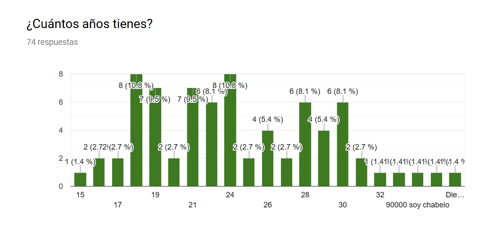

**Aquí podemos ver dos bloques bien diferenciados, el primero que va de los  18 a los 24 años y el segundo de los 28 a los 30, hay un dato que parece resolver el misterio de la edad de Chabelo al afirmar que tiene 9 mil años  (aún por confirmar).**

**Género**

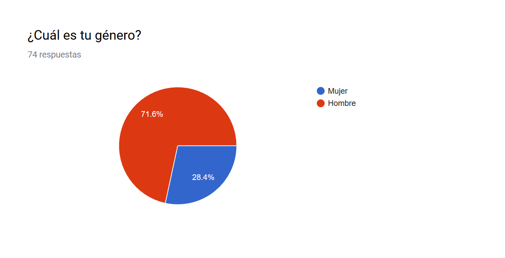

**Predominantemente jugado por hombres.**
**Características principales de un pokémon**

**Para los encuestados el tipo de pokemón, su  evolución y sus debilidades son las características más importantes.**

**Comparación**

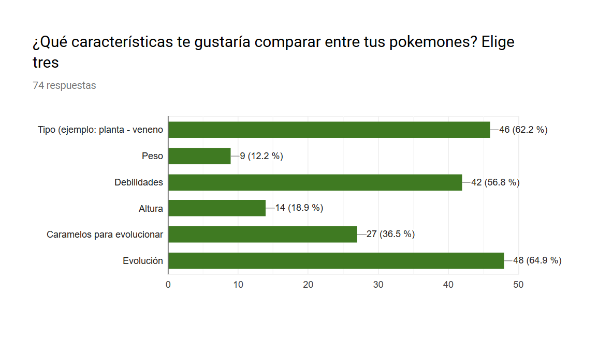

**Respecto a lo que les gustaría comparar, los datos coinciden con las características más importantes; el tipo, la evolución y las debilidades.**

## ¿QUÉ SE PROPONE AHORA?

**Con las entrevistas, las encuestas y mi experiencia jugando seguí con la propuesta inicial de crear una web app que permita visualizar las tres características más importantes de un pokémon (que tenemos disponibles) y hacer una comparació entre los mismos.**

## HISTORIAS DE USUARIO

**A continuaciónse muestra el proceso para crear las historias de usuario, qué tarea épica se crea y cuál sería la definition of done.**

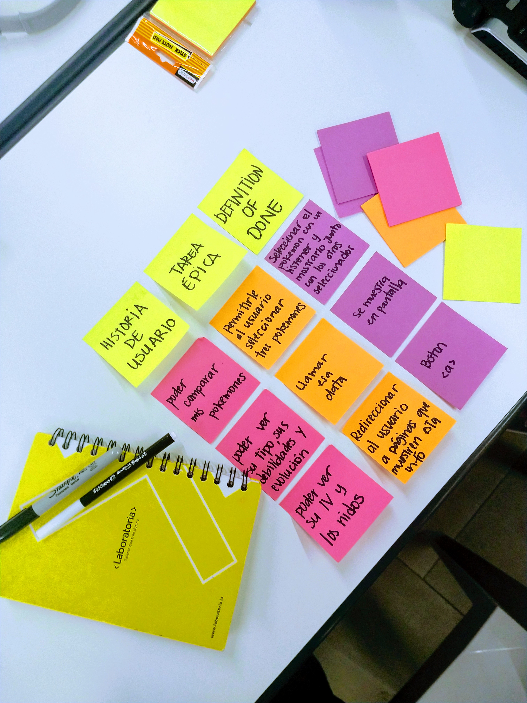

## ANÁLISIS DE LA COMPETENCIA

**Las aplicaciones que existen en el mercado son principalmente para medir el IV de los pokemones, sin embargo ninguna de ellas lo hace de forma comparativa sino de forma individual.**

**En la web sí existen páginas que proporcionan información comparativa, bastante completa, sobre pokemones.**
 
[Veekun] (https://veekun.com/dex/gadgets/compare_pokemon)

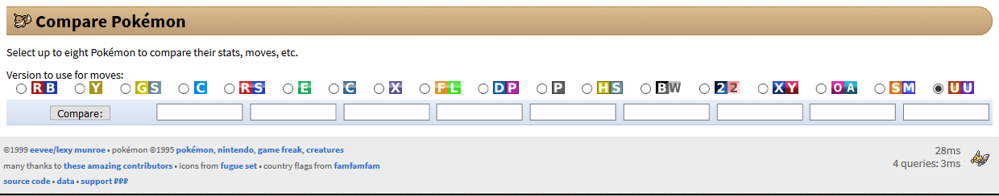

[Psypoke] (http://www.psypokes.com/dex/compare.php) 

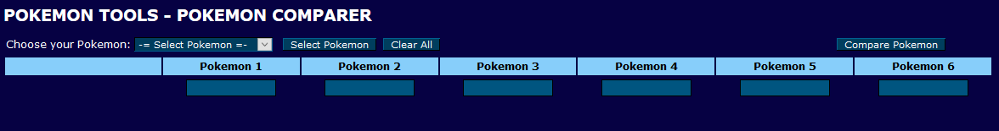

## ¿CUÁL ES EL PROBLEMA Y CÓMO RESOLVEMOS EL PROBLEMA?

**El problema sería que no hay una página web en la que  sea  fácil la  visualización de la data en un teléfono, que es lo que el 100% de los usuarios usan para jugar POKÓMON GO, además de que la data proporcionada es mucha e irrelevante para su uso en los combates.**

**Visualización en un teléfono de las web mencionadas**

**En la primer página web se necesitaron tres capturas de pantalla para visualizar todo el contenido**

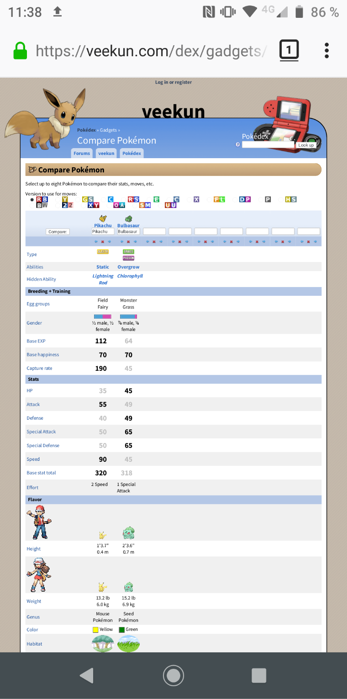
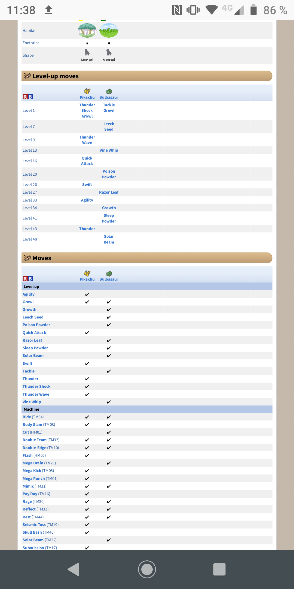
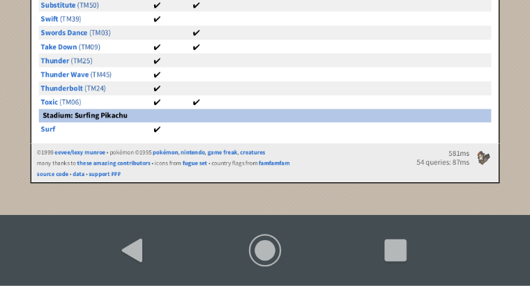

**En la segunda página web también se necesitaron tres capturas de pantalla…**

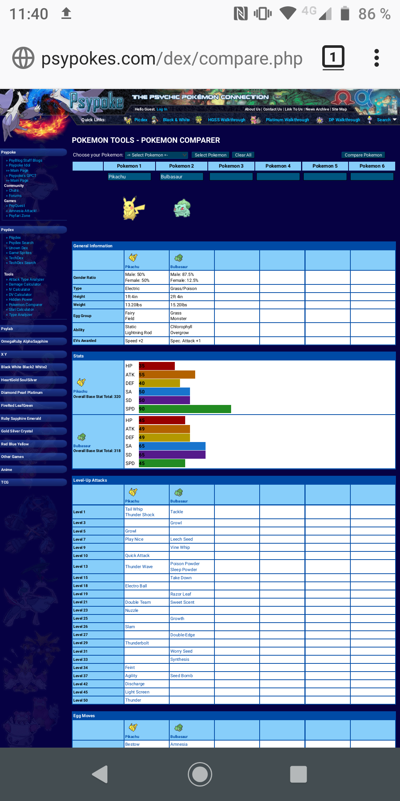
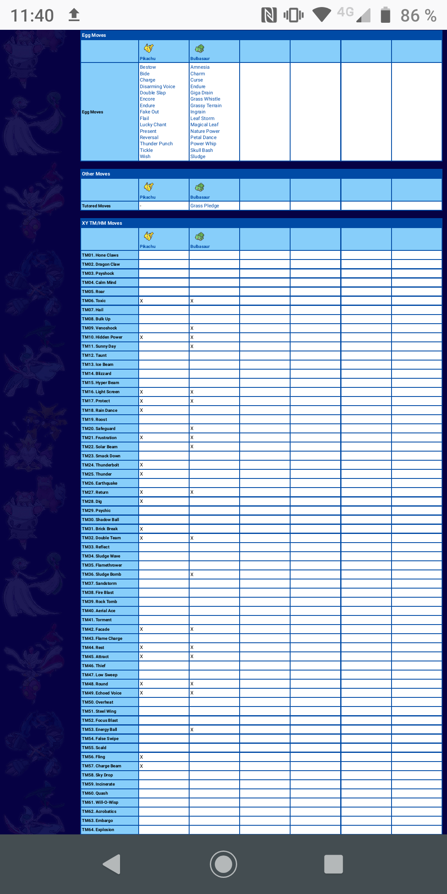
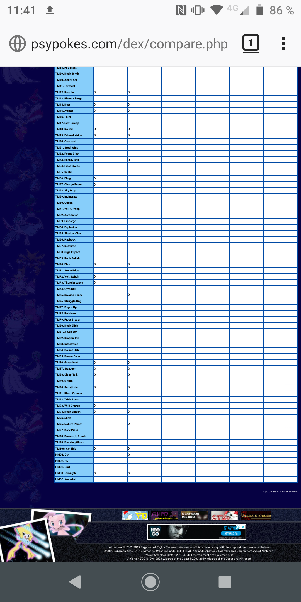

**Como se puede observar no se observa nada.**

**Esta  propuesta resuelve el problema de la visualización de datos al solo mostrar los más relevantes para el usuario, tanto para un pokémon de forma individual como al hacer la comparativa.**

## WIREFRAMING!

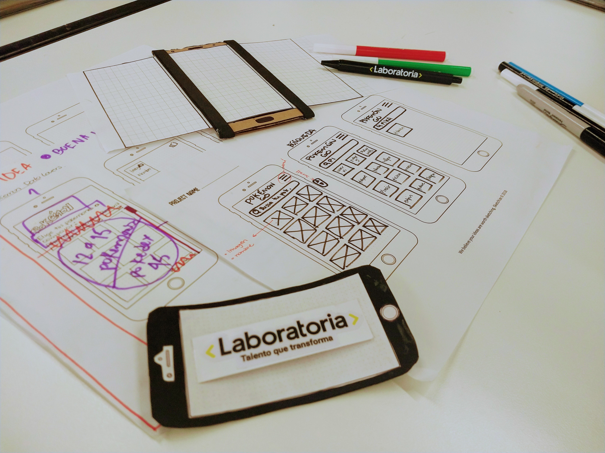

## PROTOTIPO BAJA FIDELIDAD 

**Para hacer este prototipo se utilizó marvel.**

https://marvelapp.com/54dd82c/screen/58742576 

## TESTEOS DE USABILIDAD
**En las primeras pruebas se integró la búsqueda por tipo, se agrego el valor "required" a el input de búsqueda por nombre.**
**En las siguientes pruebas se hizo cambio de color siguiendo las recomendaciones de Dení.**

# CHECKLIST
### Contenido de referencia
## Diseño de experiencia de usuario (User Experience Design)

- [x] Investigación con usuarios / entrevistas
- [x] Principios de diseño visual

## Desarrollo Front-end

- [ ] Unidad de testing en curso de JavaScript en LMS.
- [x] Unidad de arreglos en curso de JavaScript en LMS.
- [x] Unidad de objetos en curso de JavaScript en LMS.
- [x] Unidad de funciones en curso de JavaScript en LMS.
- [ ] Unidad de DOM en curso de Browser JavaScript en LMS.
- [x] Array en MDN
- [x] Array.sort en MDN
- [x] Array.map en MDN
- [x] Array.filter en MDN
- [x] Array.reduce en MDN
- [x] Array.forEach en MDN
- [x] Object.keys en MDN
- [x] Object.entries en MDN
- [ ] Fetch API en MDN
- [ ] json.org

## Herramientas

- [X] Git
- [X] GitHub
- [X] GitHub Pages
- [ ] Node.js
- [ ] Jest

## Checklist

- [x] Usa VanillaJS.
- [x] No hace uso de this.
- [ ] Pasa linter (npm pretest)
- [ ] Pasa tests (npm test)
- [ ] Pruebas unitarias cubren un mínimo del 70% de statements, functions y lines y branches.
- [x] Incluye Definición del producto clara e informativa en README.md.
- [x] Incluye historias de usuario en README.md.
- [x] Incluye sketch de la solución (prototipo de baja fidelidad) en README.md.
- [x] Incluye Diseño de la Interfaz de Usuario (prototipo de alta fidelidad) en README.md.
- [ ] Incluye el listado de problemas que detectaste a través de tests de usabilidad en el README.md.
- [ ] UI: Muestra lista y/o tabla con datos y/o indicadores.
- [x] UI: Permite ordenar data por uno o más campos (asc y desc)
- [x] UI: Permite filtrar data en base a una condición.

## Checklist (Hacker Edition)

- [ ] Consume data de forma dinámica (fetch()).
- [x] Utiliza Librerías de graficas (chart.js ó google chart).
- [ ] Cobertura de coverage al 100%.
